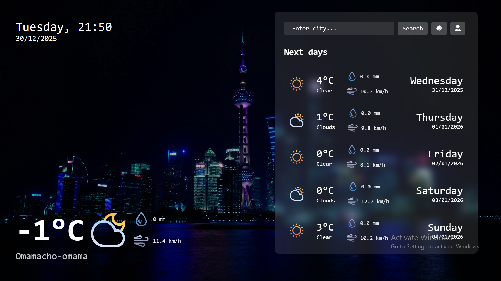
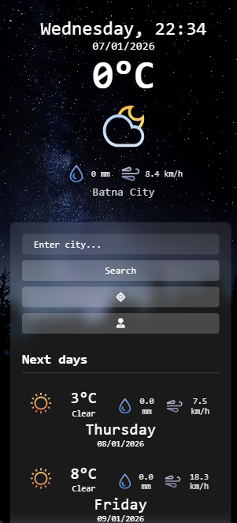

# 🌤️ Meteo — Weather Forecast Website

Welcome to **Meteo**, a sleek and responsive weather forecasting website. It allows users to view current weather conditions and forecasts based on their location or search queries. The app uses a dynamic user interface that adjusts according to time of day and device type (desktop/mobile).

## 🚀 Live Demo

Check it out here: [Meteo Live Website](https://meteo-7vyv.onrender.com)

## 🖼️ Screenshots

### Desktop View


### Mobile View



## 🧩 Features

- 🌍 Get weather data by **city name** or **device location**
- 🕓 Display current weather, including:
  - Temperature
  - Humidity
  - Wind speed
  - Weather description & icon
- 🔮 5-day weather forecast (with dynamic layout)
- 🌇 Dynamic background that changes based on:
  - Day/Night
  - Weather type (Clear, Rain, Snow, etc.)
  - Device type (Desktop or Mobile)
- 📱 Fully responsive and mobile-friendly design

## 🛠️ Technologies Used

- **HTML5**
- **CSS3**
- **JavaScript (ES6)**
- **Express.js** for backend server
- **Weather API** (e.g., OpenWeatherMap)
- **Render.com** for hosting

## 📦 Setup Instructions

1. **Clone the repository:**

```bash
git clone https://github.com/Abdelfatah10/Meteo.git
cd Meteo
```

2. **Install dependencies:**

```bash
npm install
```

3. **Create a `.env` file** in the root directory with the following variables:

```env
PORT=4000
DOMAIN=your_domain_here
NODE_ENV=development
IPGEO_API_KEY=YOUR_IPGEO_API_KEY
WEATHER_API_KEY=YOUR_WEATHER_API_KEY
FALLBACK_IP=YOUR_FALLBACK_IP
```

> 💡 See the file `.env.example` for a template.

4. **Start the development server:**

```bash
npm start
```

The application will be available at `http://localhost:4000`


## 📂 Project Structure

```
Meteo/
├── public/                  # Frontend static files
│   ├── index.html          # Main HTML file
│   ├── style.css           # Styling
│   ├── script.js           # Client-side initialization
│   ├── js/
│   │   ├── api.js          # API communication
│   │   ├── background.js   # Dynamic background logic
│   │   ├── ui.js           # UI rendering
│   │   └── uiHelpers.js    # UI helper functions
│   └── Images/             # Weather icons and backgrounds
├── src/                    # Backend server code
│   ├── app.js             # Express app setup
│   ├── server.js          # Server entry point
│   ├── controllers/       # Request handlers
│   ├── routes/            # API route definitions
│   ├── services/          # Business logic
│   └── utils/             # Utility functions
├── package.json           # Dependencies
└── README.md             # This file
```


## 🌐 APIs Used

- **OpenWeatherMap API** — weather data & forecast
- **IPGeolocation API** — location detection by IP

## 🛡️ Security Features

- **Helmet.js** - Secure HTTP headers
- **CORS** - Cross-Origin Resource Sharing
- **Rate Limiting** - Prevents API abuse
- **Error Handling** - Custom error management

## 📝 Dependencies

- **express** - Web server framework
- **cors** - Cross-origin support
- **dotenv** - Environment variable management
- **helmet** - Security middleware
- **express-rate-limit** - API rate limiting
- **node-fetch** - HTTP requests
- **nodemon** - Development auto-reload


## 📄 License

This project is licensed under the ISC License.


## 👨‍💻 Author

**Abdelfatah Djaballah** - [GitHub Profile](https://github.com/Abdelfatah10)
